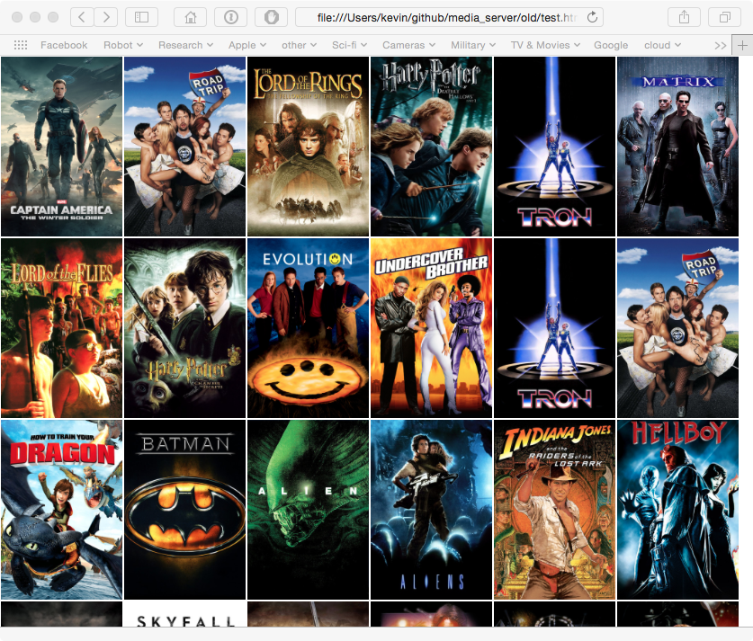
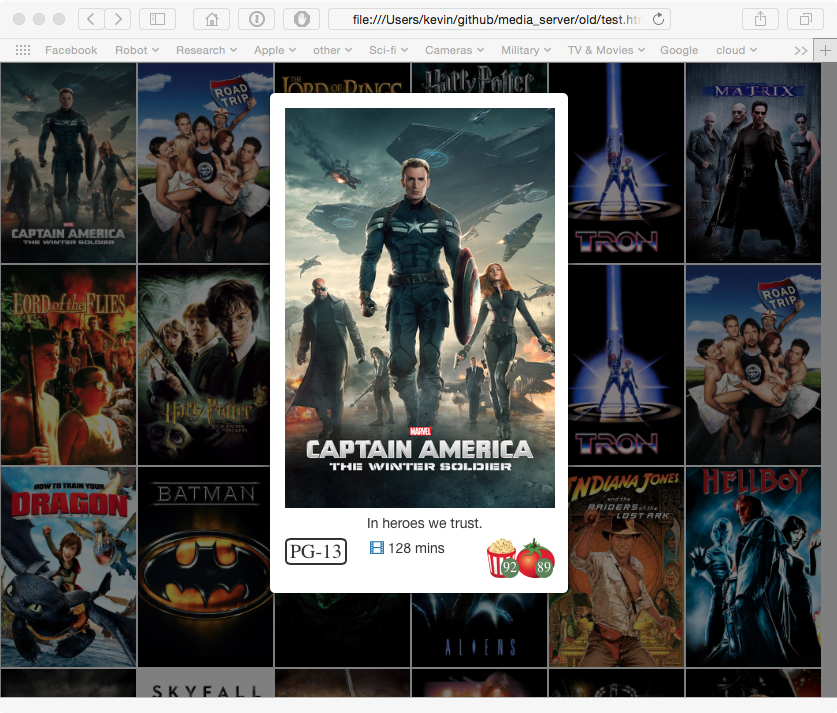

# Movie Server

## Requirements

This uses both [tmdb.org](http:tmdb.org) and [rotten tomatoes](http://rottentomatoes.com)
to get information about movies and generate a webpage. The following libraries are needed:

	sudo pip install rottentomatoes requests tmdb3

You will also have to sign-up for free API keys at both locations in order to access their info.

## Page Generator

Getting help:

	[kevin@Tardis media_server_test]$ python -m media.media -h
	usage: A simple media server [-h] [-p PAGE] [-m MOVIES]

	optional arguments:
	  -h, --help            show this help message and exit
	  -p PAGE, --page PAGE  name of webpage
	  -m MOVIES, --movies MOVIES where are the movies located

The webpage generator only needs to be run when new movies are added to a folder. 

	python -m media.media -m ./movies -p hello_kitty.html

This creates a main page (hello_kitty.html) with a tile mosaic of movie posters. Clicking on any of the posters
will open a modal window with a larger view of the poster and some information about the 
movie such as run time, rating, rotten tomato scores. There is also an icon next to the
run time, which, if clicked will take you to a trailer for the movie. Clicking on the movie
poster itself will play the movie.

## HTTP Server

The webserver is nodejs and uses http-server. To install on OSX:

	brew install node

Then get the http server

	npm install http-server -g

Then start it running

	http-server ./ -p 8080

### Raspberry Pi

The nodejs for rpi is very old. You can download it from [nodejs.org](http://nodejs.org) 
and build it from source. Then use the `npm` above to install `http-server`. 

## Usage

Now navigate to `computer:8080/<webpage_name>` to access your movies. Mine is `tardis.local:8080/movies.html`.