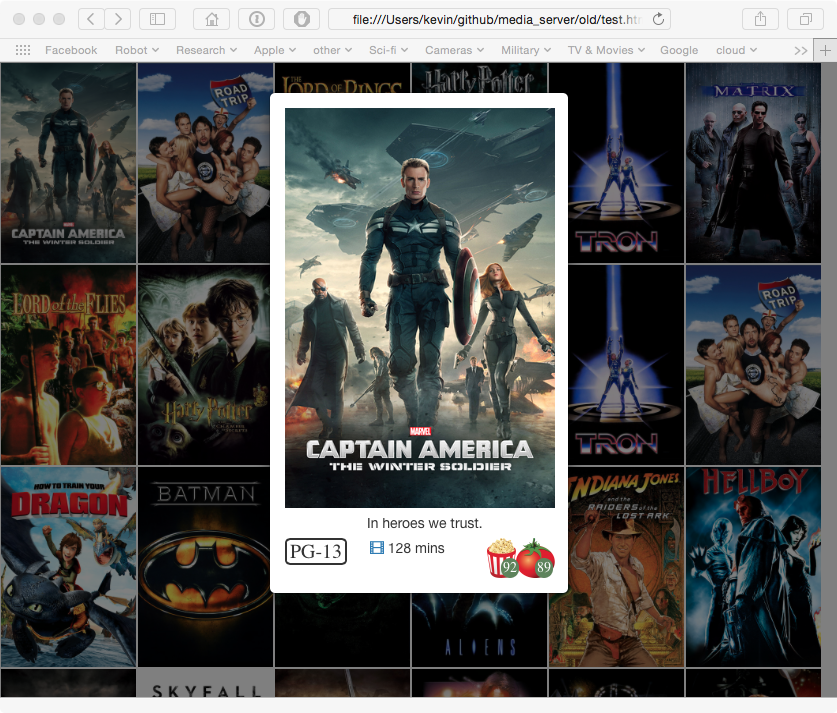

Movie Server
============

.. image:: https://travis-ci.org/walchko/media_server.svg?branch=master
    :target: https://travis-ci.org/walchko/media_server
.. image:: https://img.shields.io/pypi/v/media.svg
    :target: https://pypi.python.org/pypi/media/
    :alt: Latest Version
.. image:: https://img.shields.io/pypi/dm/media.svg
    :target: https://pypi.python.org/pypi/media/
    :alt: Downloads
.. image:: https://img.shields.io/pypi/l/media.svg
    :target: https://pypi.python.org/pypi/media/
    :alt: License

.. figure:: ./images/webpage.png
   :alt: webpage

   webpage

   modal

Requirements
------------

This uses both `tmdb.org`_ and `rotten tomatoes`_ to get information
about movies and generate a webpage. The following libraries are needed:

::

    sudo pip install rottentomatoes requests tmdb3

API Licenses
~~~~~~~~~~~~~

You will also have to sign-up for free API keys at both locations in
order to access their info. Either create a ``file.json`` with the following
format or set your environment.

::

	{
		"ROTTENTOMATOES": "1234567890",
		"TMDB": "1234567890"
	}

::
	export ROTTENTOMATOES=1234567890
	export TMDB=1234567890

Page Generator
--------------

Getting help:

::

	media -p ./ -m /dev/movies

usage: A simple media html5 generator [-h] [-p PATH] [-m MOVIES] [-k KEYS]

optional arguments:
  -h, --help                  show this help message and exit
  -p PATH, --path PATH        path to install webpages
  -m MOVIES, --movies MOVIES  absolute path to the movies
  -k KEYS, --keys KEYS        location of API keys

The webpage generator only needs to be run when new movies are added to
a folder.

::

    python -m media.media -m ./movies -p hello_kitty.html

This creates a main page (hello\_kitty.html) with a tile mosaic of movie
posters. Clicking on any of the posters will open a modal window with a
larger view of the poster and some information about the movie such as
run time, rating, rotten tomato scores. There is also an icon next to
the run time, which, if clicked will take you to a trailer for the
movie. Clicking on the movie poster itself will play the movie.

HTTP Server
-----------

The webserver is nodejs and uses http-server. To install on OSX:

::

    brew install node

Then get the http server

::

    npm install http-server -g

Then start it running

::

    http-server ./ -p 8080

Usage
-----

Now navigate to ``computer:8080/<webpage_name>`` to access your movies.
Mine is ``tardis.local:8080/movies.html``.

.. _tmdb.org: http:tmdb.org
.. _rotten tomatoes: http://rottentomatoes.com
.. _nodejs.org: http://nodejs.org

.. |Build Status| image:: https://travis-ci.org/walchko/media_server.svg?branch=master
   :target: https://travis-ci.org/walchko/media_server